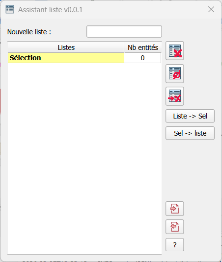
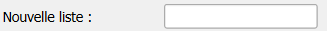
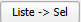
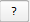
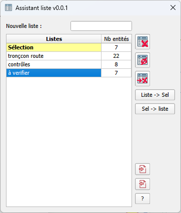
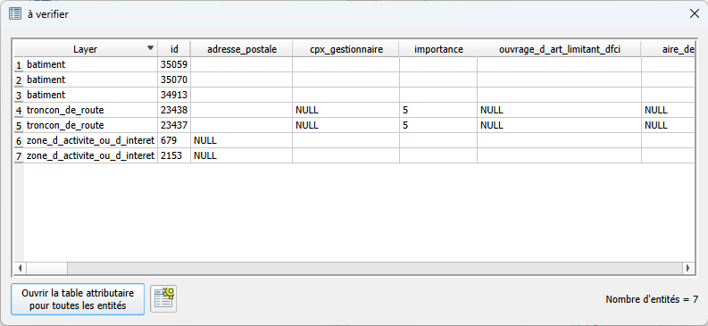
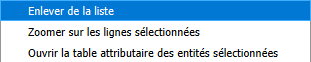

<table>
<colgroup>
<col style="width: 21%" />
<col style="width: 78%" />
</colgroup>
<tbody>
<tr>
<td rowspan="2"></td>
<td style="font-size: 24px;text-align: center;">
<strong>Manuel utilisateur du plugin
« Assistant listes »</strong>

<strong>V0.2.0</strong>
</td>
</tr>
<tr>
<td style="font-size: 16px;text-align: center;">Développeur  : Gérôme PECHEUR (IGN)</td>
</tr>
</tbody>
</table>

## Sommaire

- [1. Prérequis](#prerequis)

- [2. Résumé](#resume)

- [3 Installation](#installation)

- [4. Présentation du gestionnaire de listes](#presentation-du-gestionnaire-de-listes)

- [5. Présentation d’une liste](#presentation-dune-liste)

- [6. Création de listes](#creation-de-listes)

- [7. Ajout d’éléments dans une liste](#ajout-delements-dans-une-liste)

	- [7.1 Via : ](#via)

	- [7.2 Via : « glissé & déposé »](#via-glisse-dépose)

		- [7.2.1 D’une liste A vers la liste « sélection » :](#dune-liste-a-vers-la-liste-sélection)
		
		- [7.2.2 De la liste « Sélection » vers une liste A](#de-la-liste-sélection-vers-une-liste-a)

		- [7.2.3 D’une liste A vers une liste B](#dune-liste-a-vers-une-liste-b)
						

- [8. Suppression d’éléments dans une liste](#suppression-delements-dans-une-liste)

	- [8.1 Via le menu contextuel](#via-le-menu-contextuel)

	- [8.2 Via : « glissé & déposé »](#via-glisse-dépose)

- [9. Ouverture de la table attributaire](#ouverture-de-la-table-attributaire)

  <h2 id="prerequis" style="color: white;margin:0;" >1. Prérequis</h2>

Version de QGIS : 3.40 ou supérieur.

Le plugin « maitre » doit préalablement être installé : 
[maitre-qgis-plugin sur GitHub](https://github.com/IGNF/maitre-qgis-plugin)

  <h2 id="resume" style="color: white;margin:0;" >2. Résumé</h2>

Ce plugin permet de gérer des listes d’entités de géométries différentes
(création, suppression)

  <h2 id="installation" style="color: white;margin:0;" >3. Installation</h2>

Ouvrir QGIS.

Allez dans **Extensions/Installer/Gérer les extensions**, cliquez sur
**Installer depuis un ZIP**, sélectionner le fichier ZIP puis cliquez
sur **Installer le plugin**.

  <h2 id="presentation-du-gestionnaire-de-listes" style="color: white;margin:0;" >4. Présentation du gestionnaire de listes</h2>

Par défaut ce gestionnaire de liste intègre une liste spéciale
« Sélection »

Cette liste est mise à jour à chaque changement de sélection dans QGIS.

 : Création d’une nouvelle
liste (renseigner un nom puis appuyer sur entrée)

 : Suppression de toutes les
listes

 : Suppression de toutes les
listes vides.

 : Suppression de la liste
sélectionnée.

 : Sélection dans QGIS de
toutes les entités de la liste sélectionnée.

 : Ajout dans la liste de
toutes les entités sélectionnées dans QGIS.

 : Importation d’une liste
(identifiants ou cleabs)

 : exporter la liste
sélectionnée (le format peut être : identifiants ou cleabs)

 : A propos de … (historique des versions et
visualisation de cette documentation)

Gestionnaire configuré avec plusieurs listes.

Pour ouvrir une liste il faut faire un « double-clic » sur la liste
désirée.

  <h2 id="presentation-dune-liste" style="color: white;margin:0;" >5. Présentation d’une liste</h2>

  <h2 id="creation-de-listes" style="color: white;margin:0;" >6. Création de listes</h2>

La nouvelle liste ne doit pas se nommer « Sélection » ni être déjà
présente dans le gestionnaire.

  <h2 id="ajout-delements-dans-une-liste" style="color: white;margin:0;" >7. Ajout d’éléments dans une liste</h2>

  <h2 id="via" style="color: white;margin:0;" >7.1 via</h2>

Ajoute dans la liste toutes les entités sélectionnées dans QGIS (le
contenu de la liste est vidée avant ajout)

  <h2 id="via-glisse-dépose" style="color: white;margin:0;" >7.2 Via : « glissé & déposé »</h2>

On peut effectuer un « glisser & déposé » de lignes d’une liste vers
une autre liste.

On peut sélectionner plusieurs lignes.

  <h2 id="dune-liste-a-vers-la-liste-sélection" style="color: white;margin:0;" >7.2.1 D’une liste A vers la liste « sélection » :</h2>

- Une ou plusieurs lignes sont ajoutées à la liste « Sélection », les
  entités correspondantes sont également ajoutées à la sélection de
  QGIS.

- La liste « A » n’est pas modifiée (la ou les lignes de la liste
  d’origine ne sont pas supprimées).

  <h2 id="de-la-liste-sélection-vers-une-liste-a" style="color: white;margin:0;" >7.2.2 De la liste « Sélection » vers une liste A</h2>

- Une ou plusieurs lignes sont ajoutées à la liste « A »

- La liste « Sélection » n’est pas modifiée.

  <h2 id="dune-liste-a-vers-une-liste-b" style="color: white;margin:0;" >7.2.3 D’une liste A vers une liste B</h2>

- La ou les ligne sont supprimées de la liste « A »

- La ou les ligne sont ajoutées de la liste « B »

  <h2 id="suppression-delements-dans-une-liste" style="color: white;margin:0;" >8. Suppression d’éléments dans une liste</h2>

	

  <h2 id="via-le-menu-contextuel" style="color: white;margin:0;" >8.1 Via le menu contextuel</h2>

- On sélectionne une ou plusieurs lignes d’une liste

- Un « clic droit » fait apparaitre un menu contextuel :

Cas de la liste « Sélection » :

- La ou les lignes sont supprimées de la liste et la
  sélection dans QGIS est actualisée ;

Cas d’une liste quelconque :

- La ou les lignes sont supprimées de la liste

  <h2 id="via-glisse-dépose" style="color: white;margin:0;" >8.2 Via : « glissé & déposé »</h2>

Le glissé & déposé de la liste « A » vers la liste « B » ajoute les
lignes dans la liste « B » et supprime les lignes dans la liste « A »

  <h2 id="ouverture-de-la-table-attributaire" style="color: white;margin:0;" >9. Ouverture de la table attributaire</h2>

Via le menu contextuel il est possible d’ouvrir la table attributaire
QGIS correspondant à la ligne sélectionnées (= entités)

Si plusieurs lignes correspondent à des entités appartenant à
différentes couches, une table attributaire sera ouverte pour chaque
couche.
